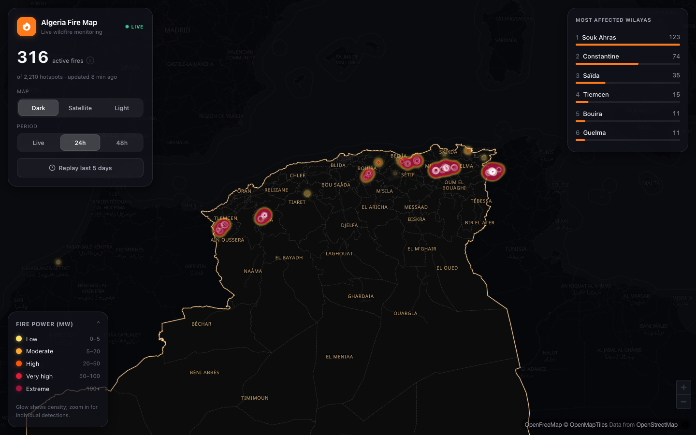
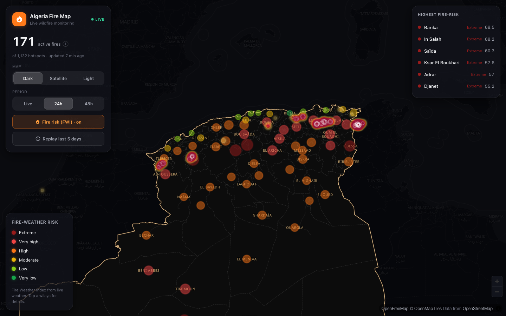
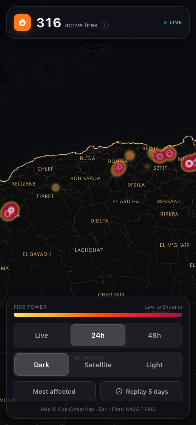

<div align="center">

# Algeria Fire Map

**Real-time satellite wildfire monitoring for Algeria** — live fire detections, intensity, history replay, and fire-risk by wilaya.

🌍 **Live:** [www.algeriafiremap.site](https://www.algeriafiremap.site)

Open source · MIT licensed · Built with NASA FIRMS, Open-Meteo & OpenStreetMap

</div>



<div align="center">

 



<sub>Fire-weather risk (FWI) by wilaya · live fires over satellite · mobile, map-first UX</sub>

</div>

---

## What it does

An interactive national map that shows where Algeria is burning, right now — and how dangerous conditions are.

- **Live fire map** — active-fire detections from NASA FIRMS (VIIRS 375 m + MODIS), updated through the day, glowing by intensity (fire radiative power).
- **Confirmed only** — we keep high-confidence detections with FRP ≥ 15 MW, filtering out low-confidence noise and small agricultural burns, so the map shows real wildfires.
- **Fire detail** — tap any fire for power (MW), confidence, detection time (Algeria local), satellite, and the **place** (town · wilaya · daïra) via reverse geocoding.
- **Timeline replay** — scrub or play back the last 5 days and watch fires appear and spread, with an activity histogram.
- **Most-affected wilayas** — live ranking; tap to fly there.
- **Fire-risk (FWI)** — per-wilaya fire-danger from the Fire Weather Index, computed from live Open-Meteo weather (the same index EFFIS uses).
- **Incidents** — raw detections are clustered server-side into fire events (first/last-seen, affected-area hull, peak intensity) for a cleaner "how many fires, how big" view.
- **Communities at risk** — inhabited places (OSM) near recent confirmed fires, tiered *severely-affected / immediate / warning*, with one-tap Google Maps directions — to help direct aid.
- **Reforestation & Recovery map** (`/restore`) — recent **burn scars** (fires that are out), priority-ranked for replanting, each labelled **forest / agricultural / rangeland** via ESA WorldCover land cover — so restoration teams know where and what to replant.
- **Statistics** — national + per-wilaya wildfire history and seasonal trends (indexable SEO pages), from 25 years of detections.
- **Map styles** — Dark, Satellite (Esri), Light. Algeria's border is highlighted and neighbours are dimmed to keep focus on the country.
- **Bilingual** (Arabic / English, full RTL), **mobile-first UX** (bottom sheet + thumb-zone controls), and multilingual SEO.

We operate on **fire-prone northern Algeria** — the Sahara is display-only, since its persistent FIRMS detections are mostly industrial gas flares, not wildfires.

## Architecture

```
NASA FIRMS ┐   Open-Meteo   OSM/Overpass   ESA WorldCover (GEE)
           ▼        ▼             ▼               ▼
  ┌──────────── FastAPI (Railway) — all APIs + schedulers ─────────────┐
  │  /fires /place /risk /events /stats /at-risk /restoration /health  │
  │  ingest cron (15 min) → dedupe → cluster → stats · land-cover sweep │
  │  Postgres + PostGIS (Supabase) · Redis cache (ETag) · all secrets   │
  └────────────────────────────┬───────────────────────────────────────┘
                               ▼  HTTPS (no secrets)
               Next.js (Vercel) — stateless, SEO, i18n
                 MapLibre GL JS · dark/satellite/light
```

- **Frontend** — Next.js (App Router, TypeScript) + MapLibre GL JS, deployed on **Vercel**. Stateless: holds no secrets, calls the API over HTTPS. Tuned for SEO (Open Graph, sitemap + hreflang, JSON-LD graph, Arabic/French/English) with privacy-friendly analytics.
- **Backend** — a single **FastAPI** service on **Railway** owning all endpoints, secrets, ingestion, clustering, and FWI, behind a **Redis** cache, with **Postgres + PostGIS** (Supabase) for detections, fire events, places and burn-scar land cover. Background schedulers keep it fresh: FIRMS ingest every 15 min, and an ESA WorldCover land-cover sweep for new burn scars.
- **Data** — [NASA FIRMS](https://firms.modaps.eosdis.nasa.gov/) (fires), [Open-Meteo](https://open-meteo.com/) (weather / FWI), [OpenStreetMap](https://www.openstreetmap.org/) / Overpass (basemaps + places), [Esri](https://www.esri.com/) (satellite), [ESA WorldCover](https://esa-worldcover.org/) via [Google Earth Engine](https://earthengine.google.com/) (land cover), [GeoAlgeria](https://www.geoalgeria.com/) (wilaya names).

## Repo layout

```
apps/web        Next.js frontend (MapLibre, SEO)
services/api    FastAPI backend (fires, place, risk, FWI)
docker-compose.yml   Local dev: api + redis
```

## Run it locally

**Prerequisites:** Node 20+, Python 3.12+, a free [NASA FIRMS MAP_KEY](https://firms.modaps.eosdis.nasa.gov/api/area/).

**Backend**
```bash
cp services/api/.env.example services/api/.env   # add NASA_FIRMS_MAP_KEY
docker compose up --build                        # API → http://localhost:8000/docs
```
…or without Docker:
```bash
cd services/api && python -m venv .venv && source .venv/bin/activate
pip install -r requirements.txt
uvicorn app.main:app --reload
```

**Frontend**
```bash
cd apps/web
cp .env.example .env.local        # NEXT_PUBLIC_API_URL=http://localhost:8000
npm install && npm run dev        # → http://localhost:3000
```

## API

| Endpoint | Description |
|---|---|
| `GET /fires?days=1..5` | Active-fire detections (GeoJSON) for northern Algeria |
| `GET /place?lat=&lng=` | Reverse-geocoded place (town · wilaya) for a fire |
| `GET /risk` | Per-wilaya Fire Weather Index + danger class |
| `GET /events` | Clustered fire incidents (centroid, hull, first/last-seen, intensity) |
| `GET /stats` · `GET /stats/wilaya/{code}` | National / per-wilaya wildfire statistics |
| `GET /at-risk` | Inhabited places near recent confirmed fires, tiered by severity |
| `GET /restoration?days=` | Recent burn scars with area, restoration priority + land cover |
| `GET /health` | Service status + data-freshness (ingest + land-cover) |

## Roadmap

- [x] Real-time fire map, confirmed filter, detail + place
- [x] Timeline replay, most-affected wilayas, mobile UX, SEO
- [x] Fire-risk (FWI) map layer + 3-day forecast
- [x] Persistence (Postgres + PostGIS) → fire-event clustering & history
- [x] Statistics (national + per-wilaya, 25 years)
- [x] Communities at risk (aid targeting)
- [x] Reforestation & Recovery map + ESA WorldCover land cover
- [ ] Sentinel-2 dNBR burn severity + slope-based erosion urgency
- [ ] ML risk prediction (trained on accumulated data)
- [ ] Alerts · citizen reporting · IoT sensors

## Contributing

Contributions are welcome — issues and PRs of all sizes. This is a public-service project for Algeria; help make it more accurate and more useful.

## License

[MIT](./LICENSE) — free to use, modify, and distribute.

## Acknowledgements

NASA FIRMS · Open-Meteo · OpenStreetMap / OpenFreeMap / OpenMapTiles · Esri World Imagery · ESA WorldCover (via Google Earth Engine) · Supabase (Postgres + PostGIS) · GeoAlgeria · Algeria's Direction Générale de la Protection Civile (DGPC).
